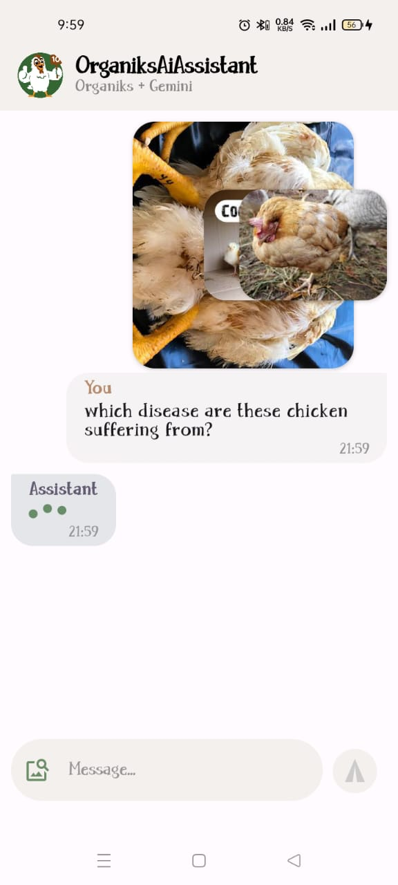
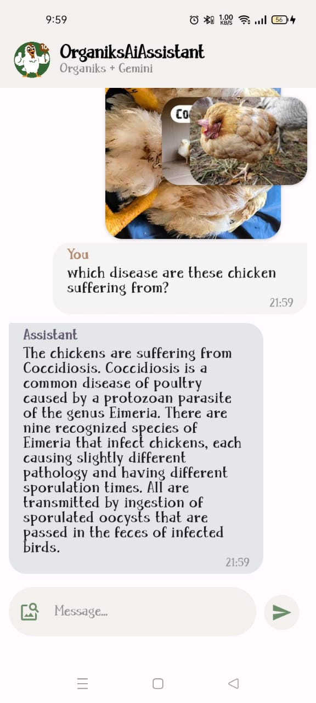
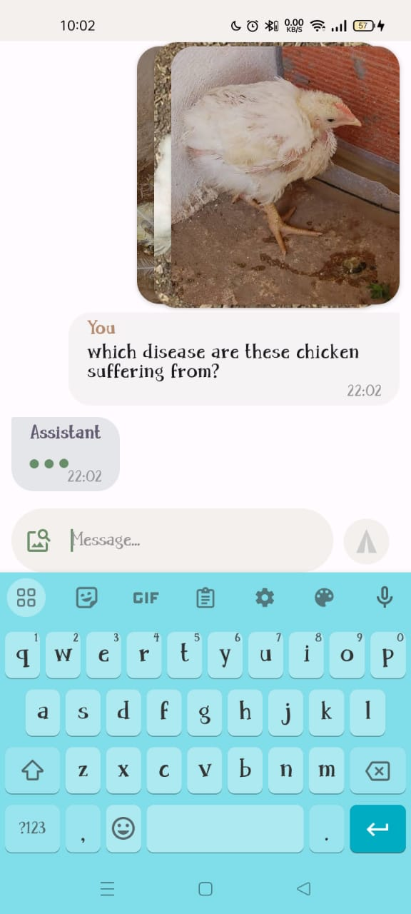
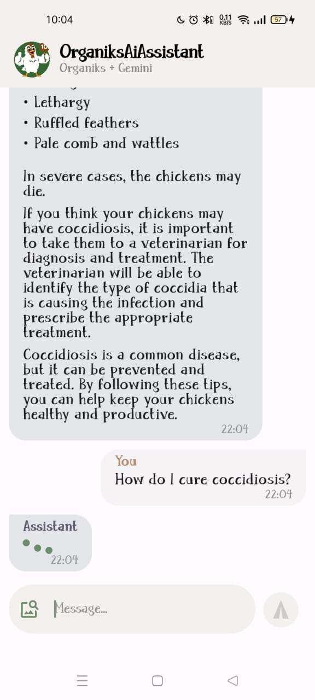
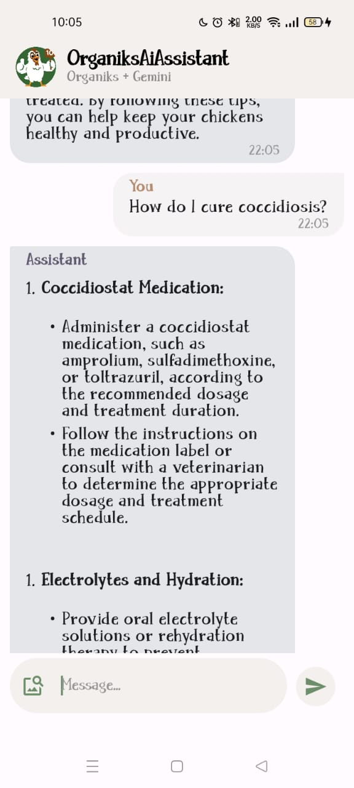

<p align="center"></p>

# OrganiksAiAssistant
OrganiksAiAssistant combines Compose Multiplatform app(Android, Desktop) + Gemini AI with the aim of making Artificial Intelligence accessible to the "common mwananchi"(common man) 
involved in Agriculture with a special interest to the Youths in Africa and the world.

The AI Assistant is aimed at becoming part of the [OrganiksKMP](https://github.com/samAricha/Organiks1_KMP_Server) project to help it in reaching its aim of empowering young farmers in Agriculture to get a competitive advantage.


## 🛠️ Prerequisites 🛠️
#### IDE
You can either use [IntelliJ IDEA](https://www.jetbrains.com/idea/) or [Android Studio](https://developer.android.com/studio/).


> For Gemini AI Assistant.
#### Gemini Api Key
You can get your key here [Google AI Studio](https://makersuite.google.com/app/prompts/new_freeform) and replace it in GeminiService.kt file
You can get Gemini API Docs here [Gemini API Docs](https://ai.google.dev/docs) 


## Screenshots
### Android






## Architecture
The app is shared between Android, Desktop with Compose Multiplatform and Server with Ktor within the same project.


## Built with
- [Kotlin Multiplatform](https://kotlinlang.org/docs/multiplatform.html) - The Kotlin Multiplatform technology is designed to simplify the development of cross-platform projects.
- [Compose Multiplatform](https://www.jetbrains.com/lp/compose-multiplatform/) -  a modern UI framework for Kotlin that makes building performant and beautiful user interfaces easy and enjoyable.
- [Ktor Server](https://ktor.io/docs/intellij-idea.html) -  Ktor is an asynchronous framework for creating microservices, web applications.
- [Ktor Client](https://ktor.io/docs/getting-started-ktor-client.html) -  a multiplatform asynchronous HTTP client, which allows you to make requests and handle responses.
- [Gemini AI](https://deepmind.google/technologies/gemini) - a multi-modal large language model(LLM) developed by Google DeepMind.
- [Calf Multiplatform File Picker](https://github.com/MohamedRejeb/Calf.git) - Calf is a library that allows you to easily create adaptive UIs for your Compose Multiplatform apps.


## Run project
### Android
To run the application on android device/emulator:
- open project in Android Studio and run imported android run configuration

### Desktop
Run the desktop application: `./gradlew :desktop:run`


## License
```xml
Copyright (c) 2024 Aricha Samson

    Permission is hereby granted, free of charge, to any person obtaining a copy
    of this software and associated documentation files (the "Software"), to deal
    in the Software without restriction, including without limitation the rights
    to use, copy, modify, merge, publish, distribute, sublicense, and/or sell
    copies of the Software, and to permit persons to whom the Software is
    furnished to do so, subject to the following conditions:

    The above copyright notice and this permission notice shall be included in all
    copies or substantial portions of the Software.

    THE SOFTWARE IS PROVIDED "AS IS", WITHOUT WARRANTY OF ANY KIND, EXPRESS OR
    IMPLIED, INCLUDING BUT NOT LIMITED TO THE WARRANTIES OF MERCHANTABILITY,
    FITNESS FOR A PARTICULAR PURPOSE AND NONINFRINGEMENT. IN NO EVENT SHALL THE
    AUTHORS OR COPYRIGHT HOLDERS BE LIABLE FOR ANY CLAIM, DAMAGES OR OTHER
    LIABILITY, WHETHER IN AN ACTION OF CONTRACT, TORT OR OTHERWISE, ARISING FROM,
    OUT OF OR IN CONNECTION WITH THE SOFTWARE OR THE USE OR OTHER DEALINGS IN THE
    SOFTWARE.
```  

  
